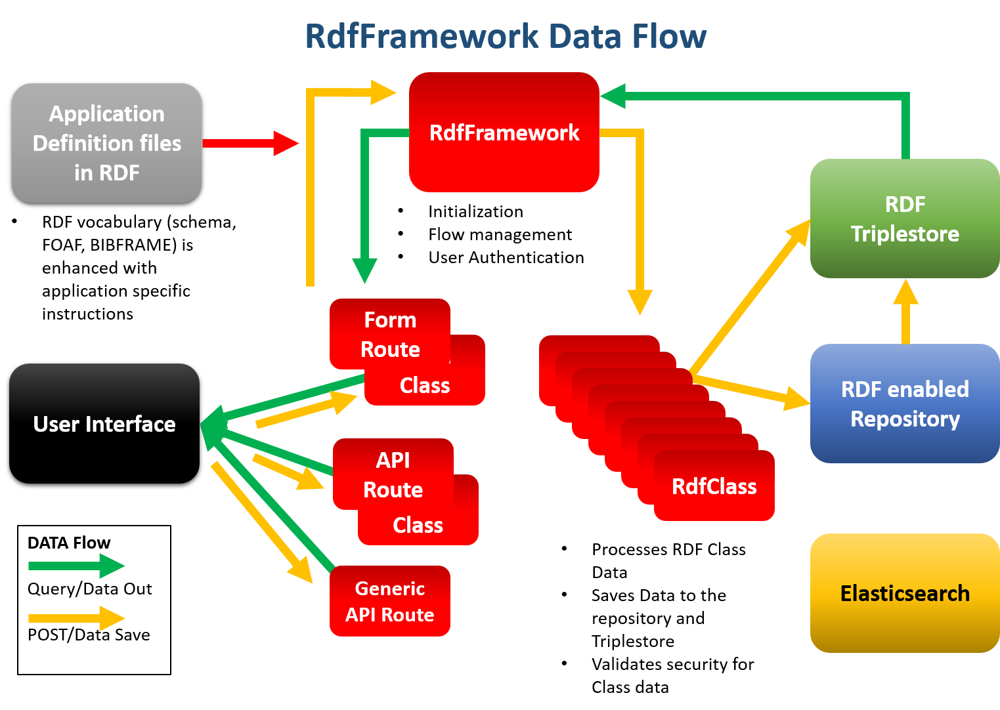

Key Concepts
**************************
Data flow in the framework
==========================

The RdfFramework class is the central clearing house for data movement. It queries the triplestore for data and passes that data to the Forms/APIs to the user interface. Data coming back to be saved comes back to the framework and is pushed to each instance of the RdfClass for processing and then saving to the databases.

* :ref:`genindex`
* :ref:`modindex`
* :ref:`search`